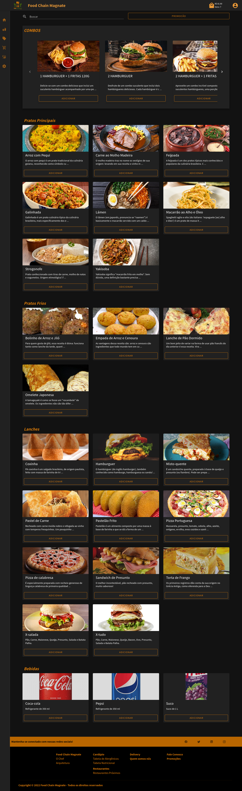

# Restaurante Food Chain Magnate

### Images

#### Home (dark)


#### Home (light)


#### Carte (dark)


#### Carte (light)


#### Promotion (dark)


#### Promotion (light)


#### Search Carte (dark)


#### Search Carte (light)


#### Shopp Cart (dark)


#### Shopp Cart (light)


#### Shopp Cart Empty (dark)


#### Shopp Cart Empty (dark)


## Project setup
```
npm install
```

### Compiles and hot-reloads for development
```
npm run serve
```

### Compiles and minifies for production
```
npm run build
```

### Lints and fixes files
```
npm run lint
```

### Customize configuration
See [Configuration Reference](https://cli.vuejs.org/config/).
