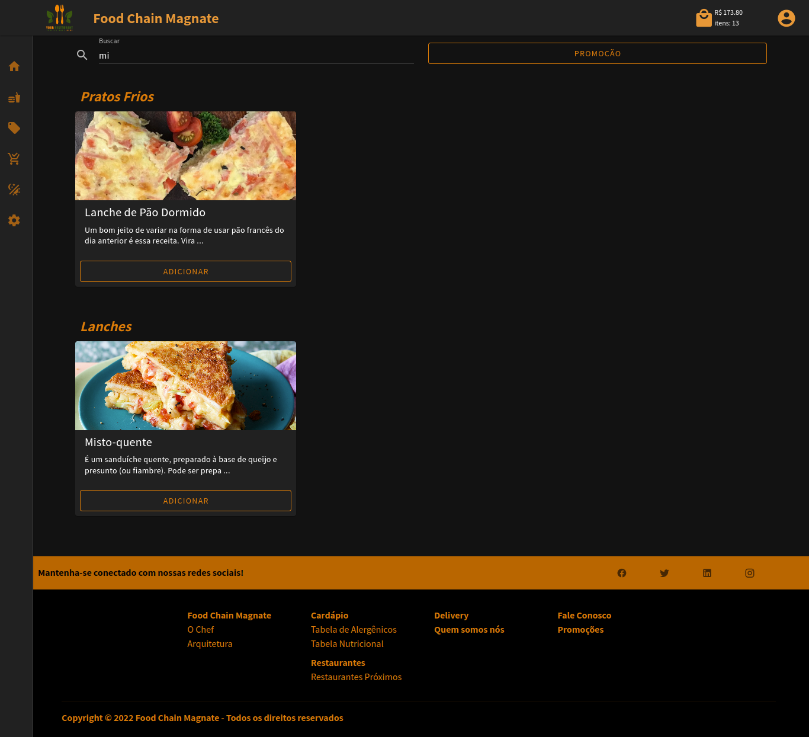

# Restaurante Food Chain Magnate

### Observação
```
O sistema ainda não está finalizado. Haverá duas permissões: o administrador terá uma tela com um v-data-table onde poderá cadastrar, remover e modificar o cardápio e as promoções. Já o cliente, se não estiver logado, será redirecionado para a página de login ao clicar em "ver os itens". Após o cadastro, ele poderá comprar os itens na loja normalmente.
```

## Descrição
```
Vue 3
Vuetify
es-Lint
Axios
Pinia
Vue-Router
Componentização
Reaproveitamento de Rotas
Código Limpo
```
<a href="https://github.com/AndreNascimento1998/api-restaurante" target="_blank">Consumindo API - api-restaurante</a>


### Images

#### Home (dark)


#### Home (light)


#### Carte (dark)


#### Carte (light)


#### Promotion (dark)


#### Promotion (light)


#### Search Carte (dark)


#### Search Carte (light)


#### Shopp Cart (dark)


#### Shopp Cart (light)


#### Shopp Cart Empty (dark)


#### Shopp Cart Empty (dark)


## Project setup
```
npm install
```

### Compiles and hot-reloads for development
```
npm run serve
```

### Compiles and minifies for production
```
npm run build
```

### Lints and fixes files
```
npm run lint
```

### Customize configuration
See [Configuration Reference](https://cli.vuejs.org/config/).
